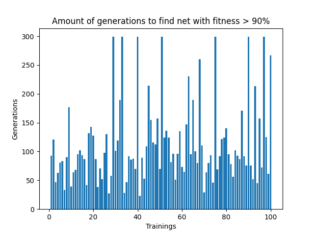

# NEAT (Neuro Evolution of Augmenting Topologies)

## Overview
This project is a python implementation of the NEAT method (Neuro Evolution of Augmenting Topologies) by Stanley and Miikkulaien. NEAT can be used to find neural networks within an exploration space in order to solve predefined optimization problems. Besides default python libraries and numpy the projects does not use other ml-related dependencies.

## Quick start with Examples

### Installation
```
git clone https://github.com/jakobschllr/NEAT_Python.git
cd NEAT_Python
pip install -r requirements.txt
```

The Parameters can be adjusted in the config.json (see explanations below)


### XOR as a benchmark non-linear problem
To try the algorithm you can choose one of two predefined problems to solve. Finding a network to solve XOR is a typical benchmark problem for measuring the performance of evolution-based machine learning models. To see the discovery process for xor start the program with `python3 init_neat.py xor`


#### Performance Evaluation
To measure the performance of my NEAT-implementation I did two different measurements for populations of 250 networks.

First, I analyzed the average fitness levels of the fittest networks in each generation for 100 evolution processes:


The average fitness of the best network is approx. at 80% after 100 Generations which in most cases is sufficient to solve XOR.


Additionally, I analazed for 100 evolution processes how many generations it takes to reach a network with a fitness larger than 90%:



As expected with evolution-algorithms the results can be very different, due to the random nature of the initial weights and biases. While there are a few cases where it took more than 300 generations to find a sufficient network, in most cases the evolution was completed within 150 generations.


### 2D-Car Simulation
The second example for you to play around with is the training of networks to control a simple car in a 2D-Simulation. You can start the program with `python3 init_neat.py car`. Then draw a racetrack with your mouse and click on "Start Evolution".


## Use NEAT for your own problems
To use this NEAT implementation on your own set of problems you have to create an instance of the `PopulationHandler` class which is localed in the neat_classes directory. This class requires initial parameters that need to be defined:

```
population_handler = PopulationHandler(
                initial_net_amount=150,
                input_neurons=4,
                output_neurons=2,
                max_generations=100,
                run_stat=run_stat,
                fitness_function=fitness_function_xor,
                fitness_function_multiple_nets=True,
                target_fitness = 0.9
)
```
| Parameter                     | Description |
|--------------------------------|-------------|
| **initial_net_amount**         | Number of networks in the initial population. During evolution, the population size will not change dramatically from this initial size. |
| **input_neurons / output_neurons** | Number of input and output neurons for all networks. These numbers depend on the problem you want to solve. |
| **max_generations**            | Number of total generations for the networks to evolve. |
| **run_stat**                   | Expects an instance of the `RuntimeStatus` class (from `neat_classes`). This object is responsible for tracking data during the evolution. |
| **fitness_function**           | A user-defined function that evaluates how well a network performs on your problem. It must assign a value to the `raw_fitness` attribute of each network. |
| **fitness_function_multiple_nets** | Defines how the fitness function is applied: <br>• **True** → the fitness function takes the entire population at once (e.g., 2D car animation, where all cars run simultaneously). <br>• **False** → the fitness function evaluates one network at a time. |
| **target_fitness** *(optional)* | Minimum fitness level for the best network. The evolution process stops once a network reaches this fitness level. Default: **1.0**. |

Here is an example for a fitness function that calculates the fitness for one network:
```
def fitness_function_xor(net):
    outputs = [
            (net.compute_inputs(0,0)[0], 0), 
            (net.compute_inputs(0,1)[0], 1),
            (net.compute_inputs(1,0)[0], 1),
            (net.compute_inputs(1,1)[0], 0)
        ]

    total_error = 0
    for out, target in outputs:
        total_error += (out-target)**2

    net.raw_fitness = 1 / (1+total_error)
```

After defining a fitness function and creating the PopulationHandler object, you can start the evolution process with
```
population_handler.initial_population()
best_net = population_handler.start_evolution_process()
```

After completing the defined amount of generations, the `start_evolution_process`-method of the population_handler returns the best network that was discovered so far. To see the outputs this network generates, you can use the `compute_inputs`-method of the network object. Here's an example:
```
            print("Best network: ", best_net)
            print("Input   |   Raw Output   |   Rounded Ouput")
            print(f" 0 0    |       {round(best_net.compute_inputs(0,0)[0], 2)}     |   {round(best_net.compute_inputs(0,0)[0])}")
            print(f" 0 1    |       {round(best_net.compute_inputs(0,1)[0], 2)}     |   {round(best_net.compute_inputs(0,1)[0])}")
            print(f" 1 0    |       {round(best_net.compute_inputs(1,0)[0], 2)}     |   {round(best_net.compute_inputs(1,0)[0])}")
            print(f" 1 1    |       {round(best_net.compute_inputs(1,1)[0], 2)}     |   {round(best_net.compute_inputs(1,1)[0])}")
```

`compute_inputs` returns a list that contains the output of each output neuron.


## Config.json
To tweak the evolution process you can adjust the parameter settings in the config.json file.
```
{
    "c1": 1.0,
    "c2": 1.0,
    "c3": 0.4,
    "species_similarity_threshold": 3.0,

    "species_survival_rate": 20,
    "elit_nets_amount": 2,
    "stagnation_treshold": 20,

    "mutation_offspring_rate": 60,
    "crossover_offspring_rate": 40,

    "weight_perturbation_prob": 10,
    "weight_mutation_random_value_prob": 10,
    "bias_weight_mutation_prob": 10,
    
    "gene_disabled_rate": 75,
    "new_neuron_prob": 20,
    "new_connection_prob": 30
}
```
| Parameter                        | Description |
|----------------------------------|-------------|
| **c1, c2, c3**                   | Influence the calculation of the compatibility distance between a new network (created by mutation or crossover) and the representative of a species. <br>• **c1** → influence of the number of matching genes. <br>• **c2** → influence of the number of excess genes. <br>• **c3** → influence of the average weight difference of matching genes. |
| **species_similarity_threshold**  | Threshold for networks to belong to the same species. If the compatibility distance is above this threshold, the network forms a new species. |
| **species_survival_rate**         | Percentage of top networks in each generation that are not deleted. Remaining networks are used for mutation and crossover. |
| **elit_nets_amount**              | Number of top networks copied to the next generation without mutation. |
| **stagnation_threshold**           | Number of generations a species can survive without fitness improvements. |
| **mutation_offspring_rate**       | Percentage of new networks created via mutation (weights, biases). |
| **crossover_offspring_rate**      | Percentage of new networks created via crossover. Must add up to 100% with `mutation_offspring_rate`. |
| **weight_perturbation_prob**      | Probability of perturbing a random connection weight within a network. |
| **weight_mutation_random_value_prob** | Probability of mutating a connection weight by setting a new random value. |
| **bias_weight_mutation_prob**     | Probability of perturbing the bias of a neuron in a network. |
| **gene_disabled_rate**            | Probability that a disabled connection stays disabled in a child network after crossover. Disabled connections occur when a hidden neuron splits an existing connection. |
| **new_neuron_prob**               | Probability of adding a new hidden neuron to the network. |
| **new_connection_prob**           | Probability of adding a new connection between existing neurons. |
